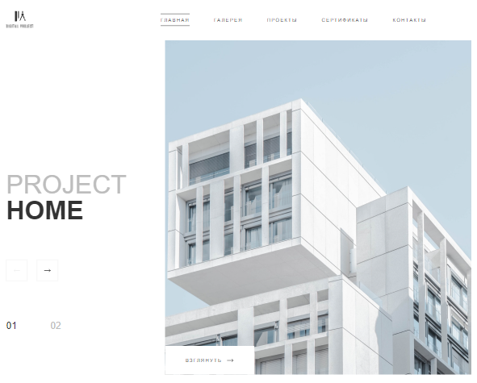

#  DIGITAL PROJECT!

## Описание:
DIGITAL PROJECT - это сайт для презентации из разного рода архитектурных решений. Совершенно адаптивный дизайн, ориентированный на любое устройство.
DIGITAL PROJECT [Live page](https://yulyarudenko88.github.io/Smart_Orange_Test/).

### Особенности:
- Удобный интерфейс для ознакомления с разными проектами и услугами.
- Адаптивный дизайн, который обеспечивает корректное отображение на различных устройствах и экранах.
- Галерея изображений для лучшего визуального представления архитектурных решений.
- Возможность ознакомления с ранее выполненными проектами.
- Осуществление обратной связи путем наполнения формы.

### Стек технологий:
- **HTML** 
- **SASS/SCSS**
- **JavaScript** 
- **AOS** 

Github репозиторий: [https://github.com/yulyarudenko88/Smart_Orange_Test](https://github.com/yulyarudenko88/Smart_Orange_Test)